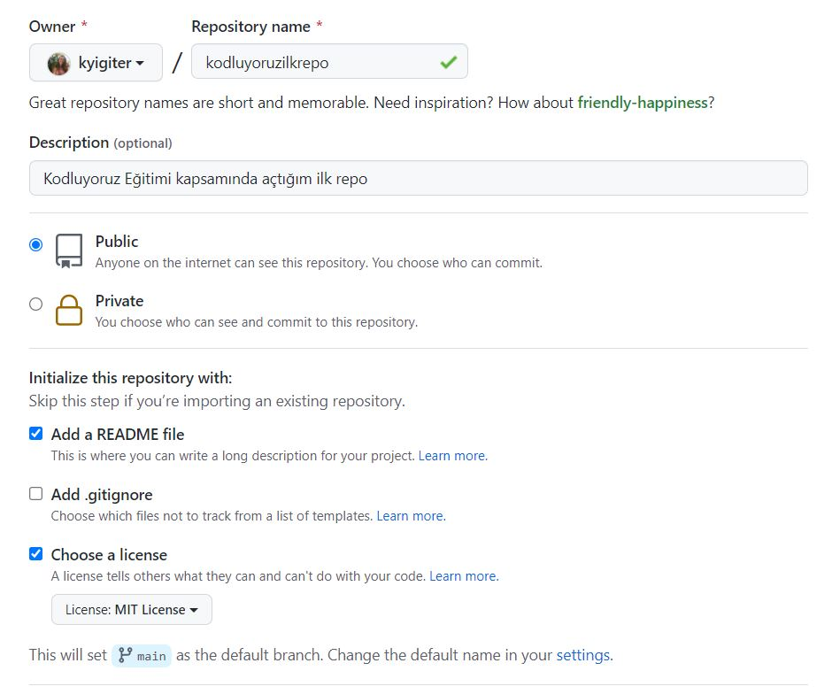

# Kodluyoruz İlk Repo
- Kodluyoruz Eğitimi kapsamında açtığım ilk repo

# Installation
```bash
git clone https://github.com/kyigiter/kodluyoruzilkrepo.git
```

# Usage 
```bash
cd ilkrepo
code .
```
# Contributing
Pull requestler kabul edilir. Büyük değişiklikler için, lütfen önce neyi değiştirmek istediğinizi tartışmak için bir konu açınız.

# Licence
[MIT](https://choosealicense.com/licenses/mit/)
